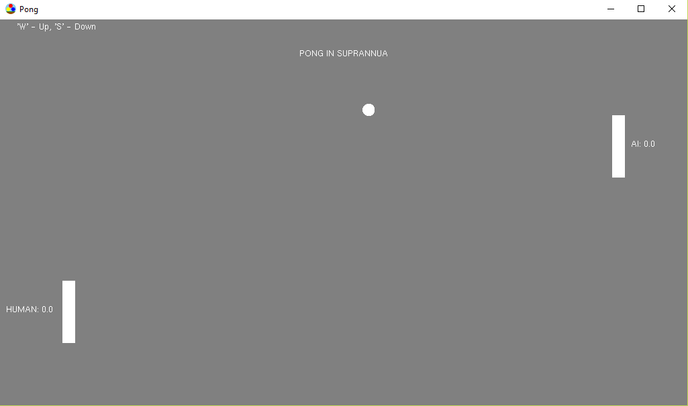
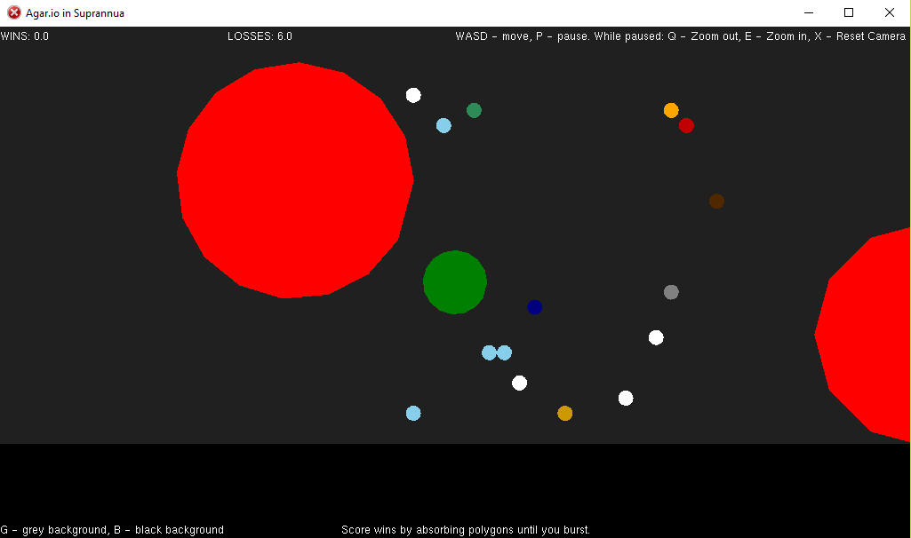
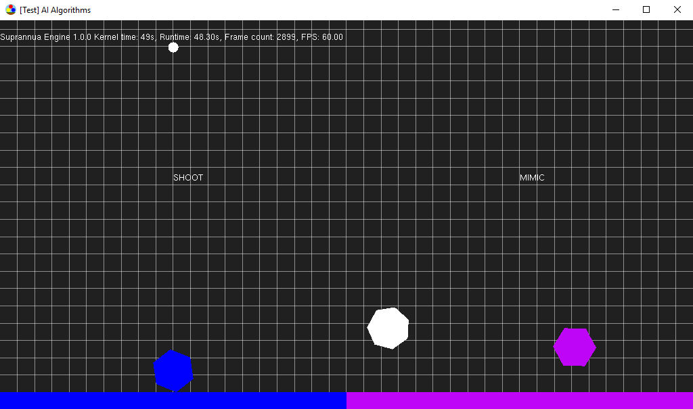
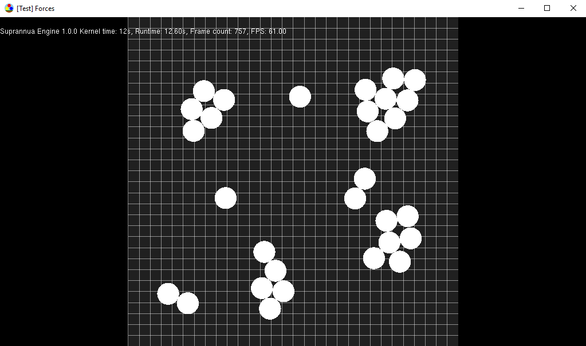

# Suprannua Engine

**Note: This project is abandoned as it was my first project made to learn how to program.**

The Suprannua Engine is a superannuated, 2D platformer game engine codebase.

## Games

## Tests

