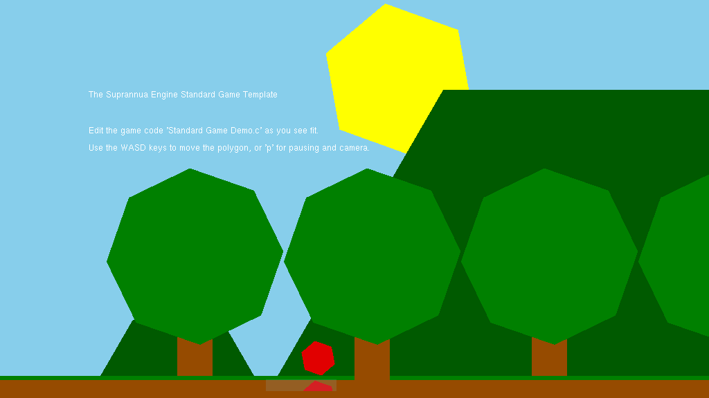
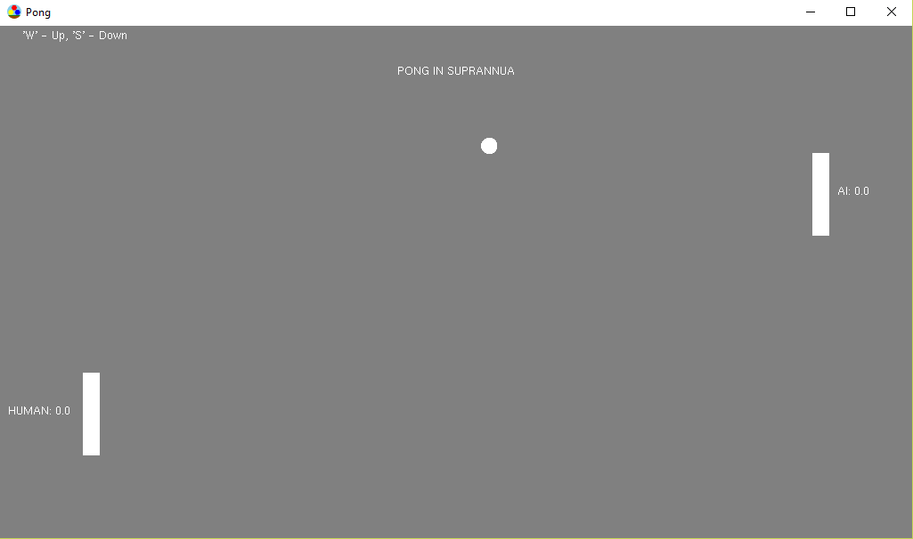
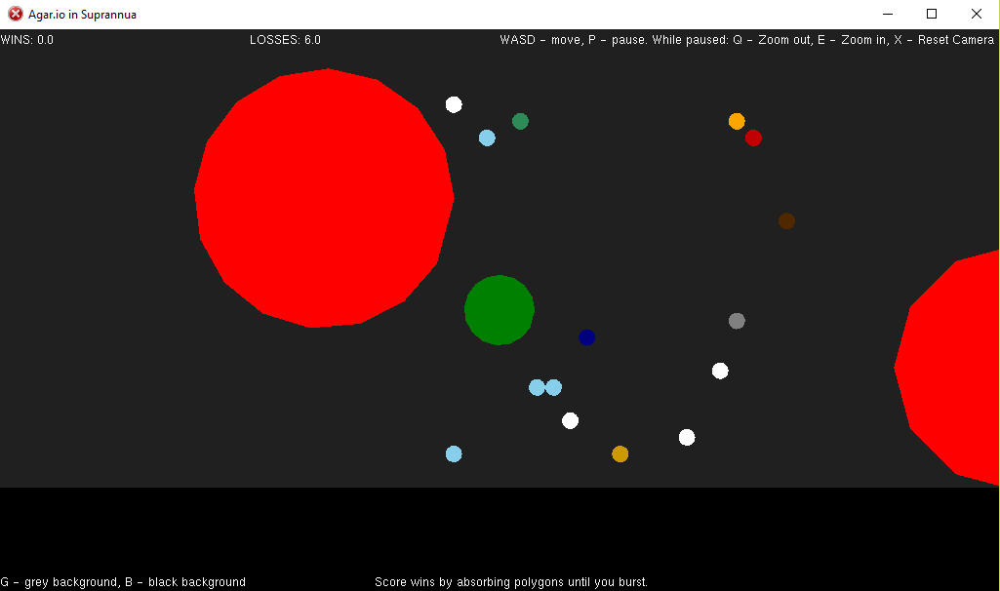
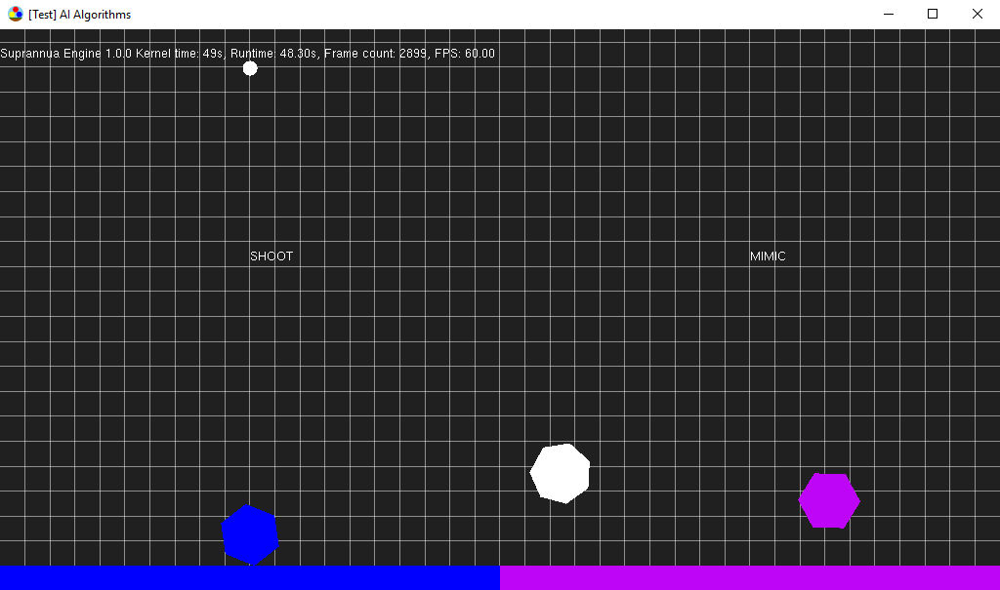
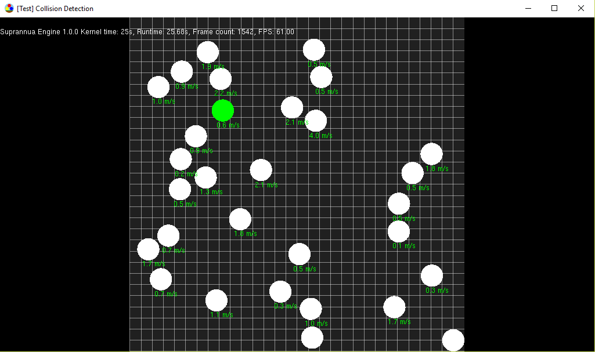
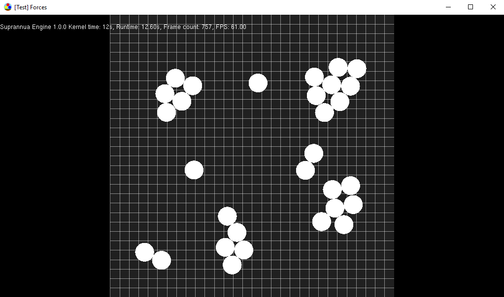

# Suprannua Engine

**Note: This project is incomplete, abandoned and archived as it was my first project made to learn how to program and made with limited planning or direction.**

[Suprannua Engine](https://github.com/Jean-LouisH/SuprannuaEngine) is **a superannuated, 2D platformer game engine codebase**.

It was my first extensive project I've ever undertaken independently - when I was a freshman at university. It was also my first time using third party software libraries. At that time I only knew C and I had a very basic understanding of programming in general, so I used it improve my skills.

You can download all the games and tests I've made with Suprannua Engine [here](https://github.com/Jean-LouisH/SuprannuaEngine/releases/download/v0.14.0-alpha/Suprannua.0.14.0.Games.Tests.zip). All movement is done through WASD keys where not specified. 

## Games

## Tests

## Documentation 

* [Suprannua Engine Architecture](https://github.com/Jean-LouisH/SuprannuaEngine/blob/master/Documentation/Suprannua%20Engine%20Architecture.pdf)